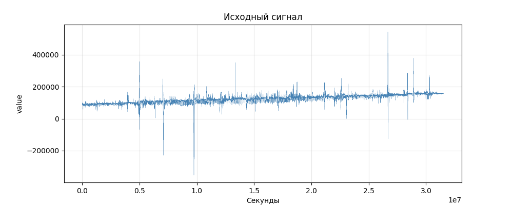
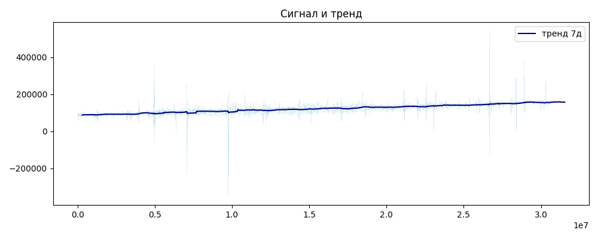
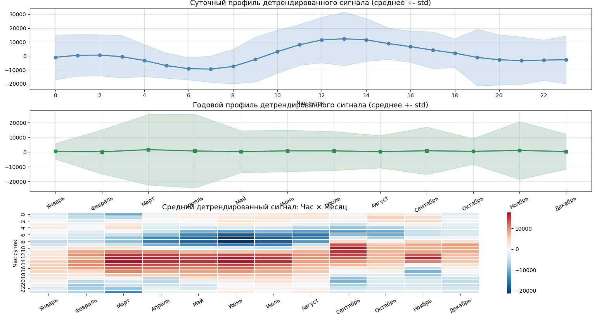
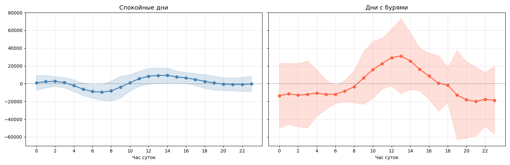
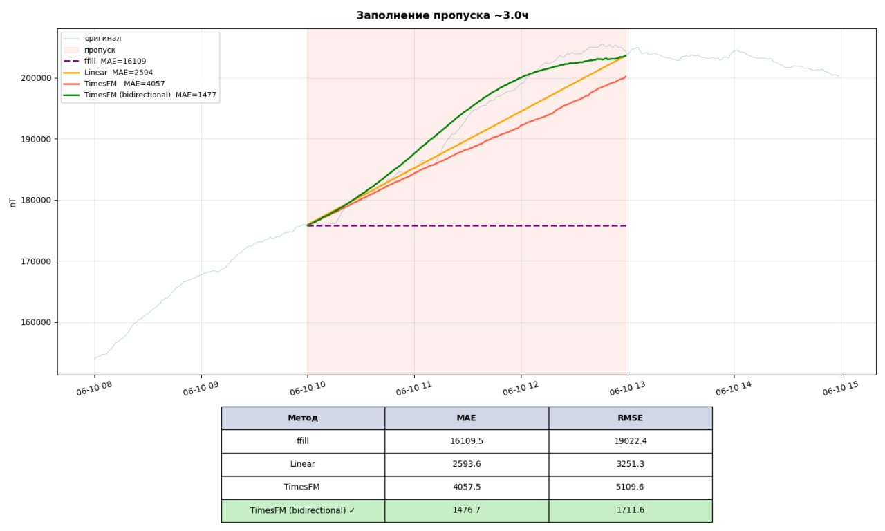
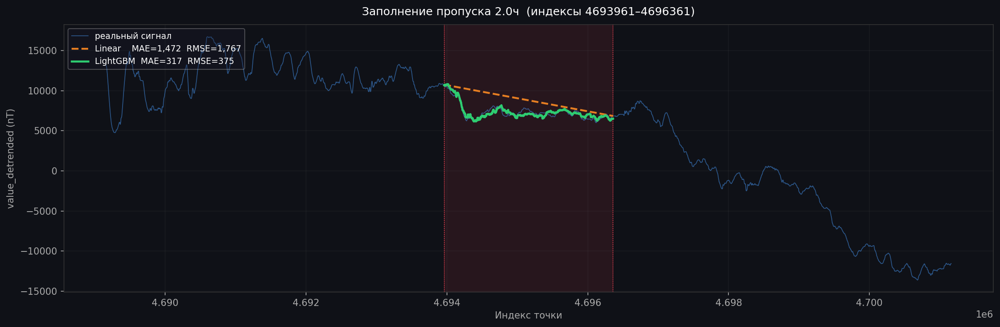
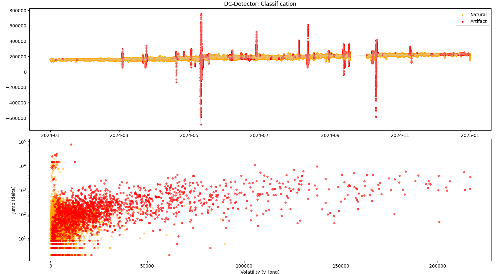
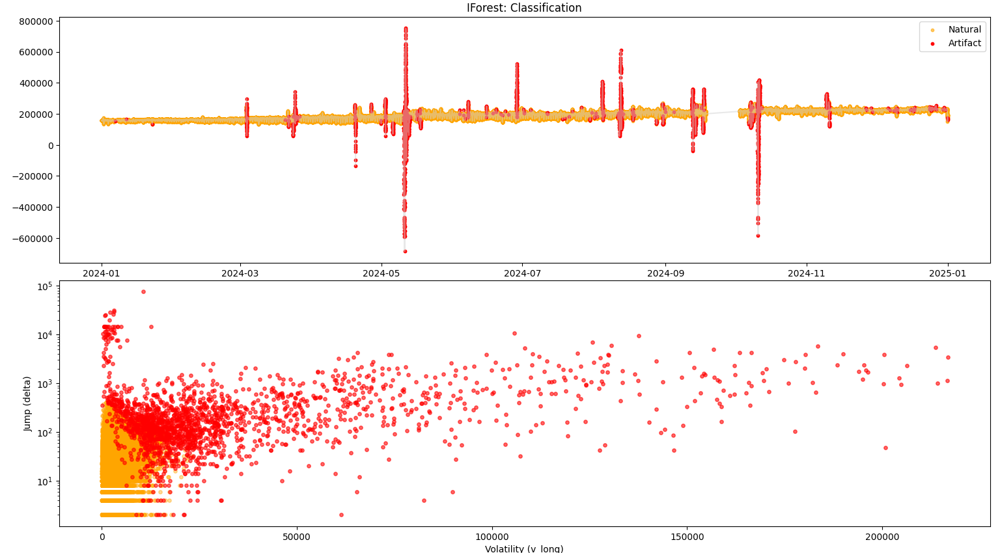

## Установка и запуск

### Зависимости

```txt
fastapi
uvicorn[standard]
python-multipart
pandas
numpy
scikit-learn
lightgbm
timesfm==1.3.0
```

Установить все зависимости:

```bash
pip install fastapi uvicorn[standard] python-multipart pandas numpy scikit-learn lightgbm timesfm==1.3.0
```

### Запуск

```bash
cd GeoMagAnalyst
uvicorn main:app --reload --port 8080
```

Открыть в браузере: [http://localhost:8080](http://localhost:8080)

# 1) Exploratory Data Analysis (EDA)

Перед построением прогнозных моделей был проведён исследовательский анализ данных для выявления структуры, закономерностей и артефактов во временных рядах вариаций геомагнитного поля.

## 1.1) Исходные данные
- **Источник:** секундные показания магнитного датчика
- **Период:** 2023 год

  Объём: ~10 млн точек

  **Колонки:**
  - seconds — счётчик времени (шаг 3 сек)
  - value — показания датчика
  - quality — флаг качества
  - accuracy — дополнительный флаг

## 1.2) Визуализация исходного сигнала:



## 1.3) Очистка от артефактов:
**Метод:** обнаружение выбросов по производной (резкие скачки)
- Порог: |diff(value)| > 50 000
- Обоснование: 99.99% всех изменений меньше 9 710
- Найдено: 16 точек-артефактов — заменены на NaN

**Важное замечание:** отрицательные значения **не** удалялись, так как они соответствуют реальным геомагнитным бурям.
## 1.4) Удаление долговременного дрейфа скользящим средним окном в 7 суток. Визуализация:

## 1.5) Анализ сезонности и суточных паттернов:

## 1.6) Разделение на спокойные дни и дни с бурями порогом активации: rolling_std_24h >= 15 000:


## 1.7) После всех этапов очистки, детрендирования и feature engineering сформирован датафрейм `prepared_df.parquet`, готовый для обучения моделей прогнозирования временных рядов.

### Структура финальных данных

| Признак | Тип | Описание |
|---------|-----|----------|
| **`value_detrended`** | float | **Целевая переменная** — очищенный от дрейфа сигнал |
| `hour` | int | Час суток (0–23) |
| `day_name` | category | День недели (Понедельник–Воскресенье) |
| `week_number` | int | Номер недели в году (1–52) |
| `month_name` | category | Название месяца |
| `month_number` | int | Номер месяца (1–12) |
| `day_of_year` | int | День года (0–364) |
| `sin_hour` | float | sin(2π × hour / 24) — циклическое кодирование часа |
| `cos_hour` | float | cos(2π × hour / 24) |
| `sin_dayofyear` | float | sin(2π × day_of_year / 365) — годовой цикл |
| `cos_dayofyear` | float | cos(2π × day_of_year / 365) |
| `lag_mean_1h` | float | Среднее `value_detrended` за последний час (сдвиг на 1) |
| `lag_mean_30min` | float | Среднее за 30 минут |
| `lag_mean_3h` | float | Среднее за 3 часа |
| `lag_mean_6h` | float | Среднее за 6 часов |
| `value_ema` | float | Экспоненциальное скользящее среднее (span = 1 час) |
| `slope_1h` | float | Наклон сигнала: разница средних за текущий и предыдущий час |
| `slope_3h` | float | Наклон за 3 часа |
| `diff_1h` | float | Разность `value_detrended` за час |
| `diff_3h` | float | Разность за 3 часа |
| `rolling_std_24h` | float | Скользящее стандартное отклонение за 24 ч — **детектор геомагнитных бурь** |


## 2) Модели для заполнения пропусков

После EDA и Feature Engineering решалась задача восстановления пропусков в минутных геомагнитных данных. Сравнивались два подхода: обученный **LightGBM** на инженерных признаках и foundation-модель **TimesFM** от Google (zero-shot, без дообучения).

### Метрики качества (на тестовых пропусках)

| Модель | MAE (nT) | RMSE (nT) |
|--------|----------|-----------|
| Linear Interpolation | ~2593 | ~3251 |
| **LightGBM** | **~317** | **~375** |
| TimesFM (bidirectional) | 1476 | 1711 |
| CatBoost | 420 | 658 |

LightGBM значительно обходит TimesFM, и слегка CatBoost — инженерные признаки и обучение на целевых данных дают решающее преимущество перед универсальной foundation-моделью.

---

### LightGBM

**Особенности:**
- Обучалась на данных 2023 года (8.5M точек train, 1.5M test)
- 19 признаков: временные (`hour`, `day_of_week`), циклические (`sin_hour`, `cos_hour`), лаги средних (`lag_mean_1h`, `lag_mean_3h`, `lag_mean_6h`), производные (`diff_1h`, `slope_1h`), `rolling_std_24h` для детекции бурь
- **Сохранённые файлы:**
models/imputation/

├── lgb_model.pkl          # модель LightGBM Booster

├── feature_cols.pkl       # список признаков


---

### TimesFM

**Особенности:**
- Предобученная foundation-модель Google (`timesfm-2.5-200m-pytorch`, 200M параметров)
- Используется в **zero-shot** режиме (без дообучения)
- Двунаправленное заполнение: прямой и обратный проход с весовой комбинацией

**Результат:** модель не адаптирована под геомагнитные данные — высокие ошибки (MAE 1476) делают её непригодной для практического использования в данной задаче.

---

### Визуальное сравнение




---

## Итог

LightGBM, CatBoost — выбранные модели для продакшена. TimesFM не подошла из-за низкой точности в zero-shot режиме на специфичных геомагнитных данных.

# 3) Детекция аномалий (артефактов)

Перед заполнением пропусков необходимо обнаружить и удалить артефакты — резкие выбросы, не соответствующие реальному геомагнитному сигналу.

### Признаки для детекции

| Признак | Описание |
|---------|----------|
| `value` | Исходное показание датчика |
| `delta` | Модуль разности соседних точек (`diff().abs()`) — фиксирует резкие скачки |
| `v_long` | Скользящее стандартное отклонение за 1 час (1200 точек × 3 сек = 1 час) — характеризует волатильность |

### Модель: Isolation Forest

**Почему он:**
- Не требует размеченных данных (unsupervised)
- Эффективно находит редкие выбросы
- Быстрый на больших данных

**Параметры:**
```python
contamination = 0.02   # ожидаемая доля аномалий (2%)
n_jobs = -1            # все доступные ядра
```
**Результат:** бинарный флаг anomaly (1 — артефакт, 0 — норма).
## Сравнение с альтернативой (DC-Detector)
Экспериментально пробовалась нейросетевая модель DC-Detector (дуальные attention механизмы, обучение на патчах). Показала более низкую точность и стабильность по сравнению с Isolation Forest, поэтому не была принята.

## Визуализация результатов




## Итог
Артефакты детектируются через Isolation Forest
